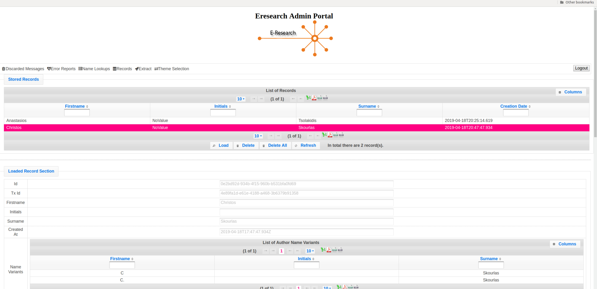
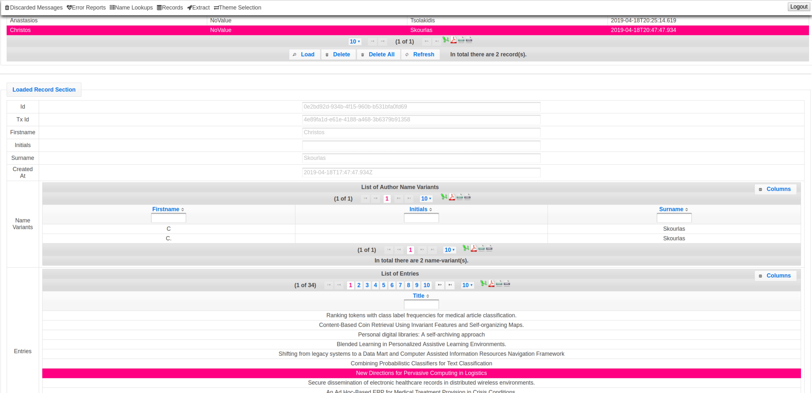
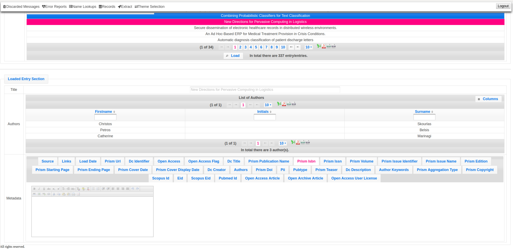
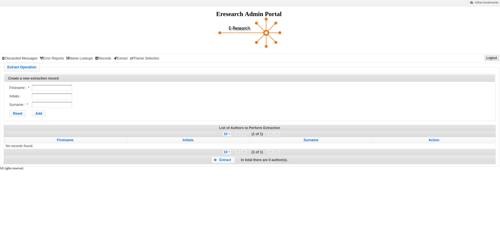
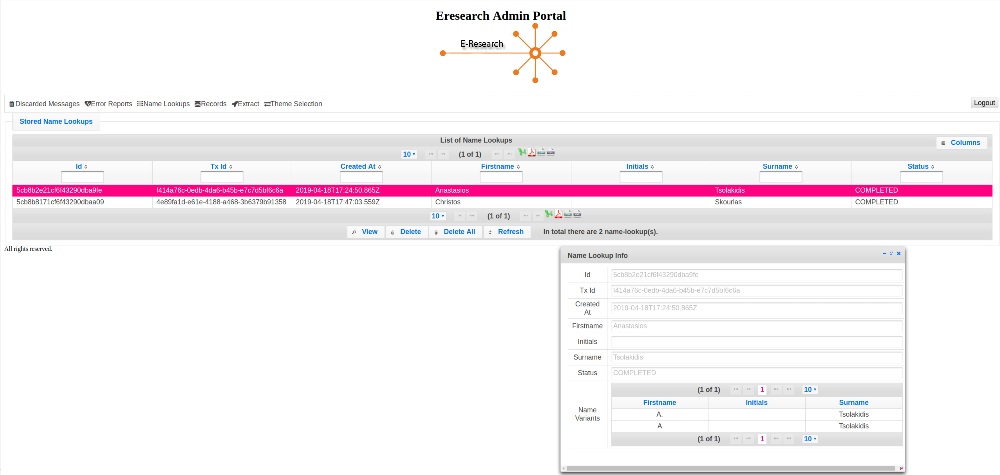
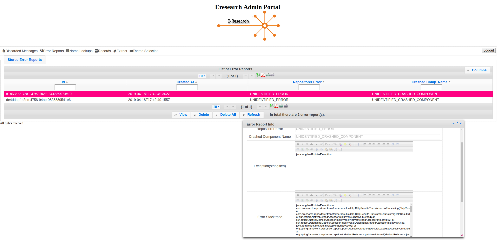
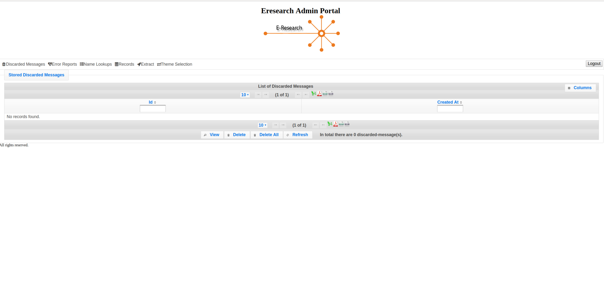

# Eresearch Repositorer Admin Portal

### Description
The purpose of this service is to provide a convenient UI for [eresearch-repositorer-service](https://github.com/chriniko13/eresearch-repositorer-service)

It exposes the following information
* Discarded Messages
* Error Reports
* Name Lookups
* Records
* Extract operation

### How to run
* Execute: `mvn tomcat7:run` in order to start the service

* Open in browser: `http://localhost:9090/admin_portal/`

* Login with credentials:
    * Username: `admin`
    * Password: `admin`

### Screenshots

1.

 

2.

 

3.

 

4.

 

5.

 

6.

 

7.

 

